# Swaptify – Documentación de la Solución

Universidad de San Carlos de Guatemala  
Ingeniería en Ciencias y Sistemas  
Curso: Software Avanzado - Sección B
``
---

## Proyecto: Swaptify

Estudiante: Walther Andree Corado Paiz  
Carnet: 201313861  

Estudiante: Gladys Leticia Ajuchán Vicente  
Carnet: 201807389  

Año: 2025 – Primer Semestre

---

# Contenido

[1. Descripcion de cada funcionalidad *](#1-descripcion-de-cada-funcionalidad)

[2. Instalación y Configuración *](#2-instalación-y-configuración)

[3. Uso y Funcionalidades *](#3-uso-y-funcionalidades)

[4. Diagrama de Arquitectura *](#4-diagrama-de-arquitectura) 

[5. Casos de Uso de Alto Nivel *](#5-casos-de-uso-de-alto-nivel)

[6. Casos de Uso Detallados *](#6-casos-de-uso-detallados)

[7. Modelo ER y Base de Datos *](#7-modelo-er-y-base-de-datos)

[8. Metodología Ágil *](#8-metodología-ágil)

[9. Requerimientos Funcionales y No Funcionales *](#9-requerimientos-funcionales-y-no-funcionales)

[10. Diagrama de alto nivel del sistema *](#10-diagrama-de-alto-nivel-del-sistema)

[11. Contratos de Microservicios *](#11-contratos-de-microservicios)

[12. Diagramas de Secuencia](#12-diagramas-de-secuencia)

[13. Gobernanza de Microservicios](#13-gobernanza-de-microservicios)


## 1. Descripcion de cada funcionalidad

### IX. Devoluciones

Esta funcionalidad permite a los usuarios gestionar la devolución de productos comprados que no hayan cumplido con sus expectativas, dentro de un plazo de 30 días. El sistema verifica que el producto no haya sido usado o dañado y que no pertenezca a una oferta especial, salvo que esté defectuoso. Solo se aceptarán devoluciones por productos de igual valor.

* Componentes funcionales: *

- Política de devolución: define el plazo y las condiciones básicas.

- Condiciones: valida que el producto sea intercambiado por otro del mismo valor.

- Proceso: el usuario selecciona el producto, puede indicar un motivo y el sistema lo envía a revisión.

- Módulo de gestión interna: acceso restringido a usuarios autorizados para revisar y aprobar/rechazar solicitudes.

- Resultado de aceptación: si es aprobada, se genera un cupón de descuento por el valor del producto devuelto.

* Restricciones: *

- No aplica a productos en oferta, excepto si están defectuosos.

- No se aceptan productos usados o dañados.

### X. Pagos

Permite a los usuarios realizar pagos por sus compras mediante tarjetas bancarias. El sistema también acepta pagos híbridos, es decir, combinar tarjeta de crédito y débito en una sola transacción.

* Componentes funcionales: *

- Método de pago con tarjeta: opción de ingresar datos de tarjeta de crédito o débito.

- Pagos híbridos: sistema que permite dividir el monto entre dos tipos de tarjeta.


### XI. Soporte por Chatbot

Brinda atención inmediata a través de un chatbot integrado que responde preguntas sobre productos, pedidos y devoluciones. También permite acciones como agregar productos al carrito especificando su nombre y cantidad.

* Componentes funcionales: *

- Atención de consultas: sobre disponibilidad, estado de pedidos, devoluciones, etc.

- Interacción activa: el chatbot puede ejecutar acciones como agregar productos al carrito si se proporciona el nombre.

---

# 2. Instalación y Configuración

### Instalación Prometheus

1. Descargar Prometheus 
```
wget https://github.com/prometheus/prometheus/releases/download/v2.51.0/prometheus-2.51.0.linux-amd64.tar.gz
tar -xvzf prometheus-2.51.0.linux-amd64.tar.gz

cd prometheus-2.51.0.linux-amd64
```

2. Ejecutar Prometheus
```
./prometheus --config.file=prometheus.yml
```

3. Configuracion en prometheus.yml
```
global:
  scrape_interval: 15s

scrape_configs:
  - job_name: 'prometheus'
    static_configs:
      - targets: ['localhost:9090']
```

- Prometheus Operator

1. Aplica los CRDs:
```
kubectl apply -f setup/
```

2. Instalar Prometheus Operator con Helm:
```
helm repo add prometheus-community https://prometheus-community.github.io/helm-charts
helm repo update
helm install prometheus prometheus-community/kube-prometheus-stack --namespace monitoring --create-namespace
```

3. Verificar
```
kubectl get pods -n monitoring
kubectl port-forward svc/prometheus-kube-prometheus-prometheus 3000:3000 -n monitoring
```

### Grafana

1. Instalacion

```
sudo apt-get install -y software-properties-common
sudo add-apt-repository "deb https://packages.grafana.com/oss/deb stable main"
wget -q -O - https://packages.grafana.com/gpg.key | sudo apt-key add -
sudo apt-get update
sudo apt-get install grafana -y
sudo systemctl enable --now grafana-server
```

### ELK Stack (Elasticsearch + Logstash + Kibana)

1. Elasticsearch
```
wget https://artifacts.elastic.co/downloads/elasticsearch/elasticsearch-8.13.0-amd64.deb
sudo dpkg -i elasticsearch-8.13.0-amd64.deb
sudo systemctl enable --now elasticsearch
```

2. Logstash
```
wget https://artifacts.elastic.co/downloads/logstash/logstash-8.13.0-amd64.deb
sudo dpkg -i logstash-8.13.0-amd64.deb
sudo systemctl enable logstash
```
3. Kibana

```
wget https://artifacts.elastic.co/downloads/kibana/kibana-8.13.0-amd64.deb
sudo dpkg -i kibana-8.13.0-amd64.deb
sudo systemctl enable --now kibana

```
### Configuración de entorno

| Herramienta    | Puerto  | URL de Acceso Local           | Ejecucion                   |
|----------------|---------|-------------------------------|-------------------------------------------|
| Prometheus     | 9090    | http://localhost:9090         | Archivo `prometheus.yml`         |
| Grafana        | 3000    | http://localhost:3000         | Añadir datasource         |
| Elasticsearch  | 9200    | http://localhost:9200         | autenticación/config. avanzada  |
| Kibana         | 5601    | http://localhost:5601         | Configurar conexión con Elasticsearch     |
| Logstash       | -       | -                             | Archivo de configuración         |

---

# 3. Uso y Funcionalidades

## 1. Prometheus

* Guía de Usuario 

Prometheus es una herramienta de monitoreo basada en series de tiempo. Su función principal es recolectar métricas de servicios y exponerlas para visualización o alertas.

* Funcionalidades clave de Prometheus 

| Función                      | Descripción                                                                 |
|-----------------------------|-----------------------------------------------------------------------------|
| Recolección de métricas     | Se configura vía `prometheus.yml`, definiendo trabajos y endpoints.        |
| Consulta con PromQL         | Utiliza su propio lenguaje (PromQL) para consultar métricas complejas.     |
| Almacenamiento local        | Guarda datos en disco con su propio motor de almacenamiento.               |
| Alertas (Alertmanager)      | Permite definir reglas de alerta y enviar notificaciones (email, Slack).   |

* Cómo configurar una alerta 

```
groups:
- name: ejemplo-alertas
  rules:
  - alert: InstanciaCaida
    expr: up == 0
    for: 1m
    labels:
      severity: critical
    annotations:
      summary: "Instancia {{ $labels.instance }} no disponible"
      description: "La instancia {{ $labels.instance }} lleva caída más de 1 minuto."
```

## 2. Grafana

* Guía de Usuario 

Grafana es una plataforma de visualización de métricas. Su fortaleza es la creación de paneles dinámicos y la integración con múltiples fuentes de datos.

* Funcionalidades clave de Grafana 

| Función                      | Descripción                                                                 |
|-----------------------------|-----------------------------------------------------------------------------|
| Paneles (Dashboards)        | Permite crear dashboards personalizados usando múltiples visualizaciones.  |
| Alertas visuales            | Posibilidad de configurar alertas desde los gráficos directamente.         |
| Múltiples fuentes de datos  | Soporta Prometheus, MySQL, Elasticsearch, entre otros.                     |
| Compartir e incrustar       | Puedes compartir paneles por URL o embeberlos en otras aplicaciones.       |

* Cómo crear un panel 

- Ir a Dashboards > New Dashboard

- Click en Add new panel

- Seleccionar fuente de datos (por ejemplo, Prometheus)

- Ingresar una consulta (http_requests_total[5m])

- Ajustar visualización (línea, barra, etc.)

- Guarda el panel con nombre y carpeta.


## 3. ELK Stack (Elasticsearch, Logstash, Kibana)

* Guía de Usuario 

ELK Stack es una solución completa para recolección, almacenamiento y visualización de logs.

- Elasticsearch: motor de búsqueda que indexa y consulta datos.

- Logstash: pipeline que recoge, transforma y envía logs a Elasticsearch.

- Kibana: interfaz para visualización y análisis de logs.

* Funcionalidades clave de ELK Stack 

| Herramienta     | Función                         | Descripción                                                              |
|-----------------|----------------------------------|--------------------------------------------------------------------------|
| Elasticsearch   | Indexación de datos             | Permite búsquedas rápidas en grandes volúmenes de datos                  |
| Logstash        | Transformación de logs          | Entrada > Filtro > Salida, permite parseo y envío de logs a Elasticsearch|
| Kibana          | Dashboards, búsquedas y alertas | Crear visualizaciones, dashboards y exploración avanzada de logs        |

* Cómo visualizar logs en Kibana 

- Iniciar sesión en http://localhost:5601

- Ir a Stack Management > Index Patterns

- Crear un patrón como logstash-*

- Ir a Discover para explorar los logs

- Crear visualizaciones en Visualize > Create Visualization

---
## 4. Diagrama de Arquitectura

La arquitectura general del sistema se basa en microservicios, desplegados en contenedores Docker y orquestados con Kubernetes.

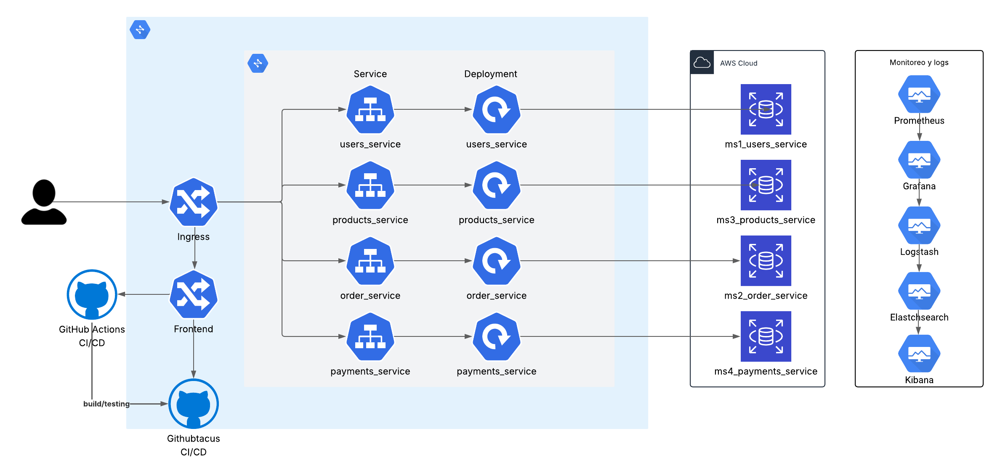
---

# 5. Casos de Uso de Alto Nivel

### CU01 – Registrarse como usuario

* Objetivo: Permitir que un nuevo usuario cree una cuenta en la plataforma proporcionando su información personal.

* Actores: Usuario

* Precondiciones: El usuario no debe tener una cuenta registrada y debe tener un correo electrónico válido.

* Flujo principal: 1. El usuario accede al formulario de registro. 2. Ingresa sus datos personales: nombre, apellido, correo, dirección, etc. 3. Envía el formulario. 4. El sistema valida la información, guarda los datos y envía un correo de confirmación con caducidad de 2 minutos.

* Flujo alterno: 2a. Si el correo ya existe, el sistema muestra un mensaje de error y no permite continuar. 4a. Si ocurre un error al enviar el correo, se notifica al usuario.

---

### CU02 – Confirmar cuenta por correo

* Objetivo: Activar la cuenta del usuario mediante el enlace de confirmación enviado al correo electrónico.

* Actores: Usuario

* Precondiciones: El usuario debe haberse registrado previamente y haber recibido el correo de confirmación.

* Flujo principal: 1. El usuario abre su correo electrónico. 2. Da clic en el enlace de confirmación. 3. El sistema valida que el enlace esté activo y vigente. 4. Si todo es correcto, la cuenta queda activada.

* Flujo alterno: 3a. Si el enlace ha caducado, se informa al usuario y se da opción de reenviar. 3b. Si el enlace es inválido, se muestra un mensaje de error.

---

### CU03 – Iniciar sesión

* Objetivo: Permitir que un usuario autenticado acceda a su cuenta en el sistema.

* Actores: Usuario

* Precondiciones: El usuario debe estar registrado, con la cuenta confirmada y activa.

* Flujo principal: 1. El usuario accede al formulario de inicio de sesión. 2. Ingresa su correo o nombre de usuario y contraseña. 3. El sistema verifica las credenciales. 4. Si son válidas, el usuario accede al sistema.

* Flujo alterno: 2a. Si las credenciales son incorrectas, se muestra un mensaje de error. 3a. Si la cuenta está inactiva o sin confirmar, el acceso es rechazado.

---

### CU04 – Editar perfil

* Objetivo: Permitir al usuario modificar su información personal dentro de su cuenta.

* Actores: Usuario

* Precondiciones: El usuario debe haber iniciado sesión en el sistema.

* Flujo principal: 1. El usuario accede a “Mi Perfil”. 2. Modifica uno o varios datos como correo, teléfono o dirección. 3. Guarda los cambios. 4. El sistema valida y actualiza la información.

* Flujo alterno: 2a. Si se ingresa un correo ya utilizado por otro usuario, se muestra un error. 3a. Si algún campo es inválido (por ejemplo, formato de correo), se bloquea el envío.

---

### CU05 – Visualizar productos

* Objetivo: Permitir a cualquier usuario navegar por los productos disponibles en la plataforma.

* Actores: Usuario

* Precondiciones: El sistema debe tener productos cargados en el catálogo.

* Flujo principal: 1. El usuario ingresa a la página de inicio o al catálogo. 2. El sistema carga y muestra los productos por categorías como más vendidos, ofertas, nuevos, etc. 3. El usuario navega libremente por las secciones.

* Flujo alterno: 2a. Si no hay productos disponibles, se muestra un mensaje de “Sin resultados”. 3a. Si ocurre un error al cargar las categorías, se muestra un mensaje genérico.

---

### CU06 – Agregar producto al carrito

* Objetivo: Permitir al usuario seleccionar un producto y añadirlo a su carrito de compras con una cantidad específica.

* Actores: Usuario

* Precondiciones: El usuario debe estar registrado e iniciar sesión para guardar el carrito; si no ha iniciado sesión, el carrito se guarda de forma temporal.

* Flujo principal: 1. El usuario navega por el catálogo y selecciona un producto. 2. Ingresa la cantidad deseada. 3. Da clic en "Agregar al carrito". 4. El sistema agrega el producto al carrito con la cantidad seleccionada y muestra una notificación de confirmación.

* Flujo alterno: 2a. Si la cantidad es inválida (por ejemplo, 0 o mayor al stock disponible), se muestra un error. 3a. Si el usuario no ha iniciado sesión, se le sugiere registrarse para guardar su carrito permanentemente.

---

### CU07 – Realizar compra

* Objetivo: Permitir al usuario completar una compra y realizar el pago de los productos en su carrito.

* Actores: Usuario

* Precondiciones: El usuario debe tener productos en su carrito y haber iniciado sesión.

* Flujo principal: 1. El usuario accede al carrito y revisa el resumen de su compra. 2. Selecciona método de pago (tarjeta de crédito, débito o combinación). 3. Ingresa los datos de pago y confirma. 4. El sistema procesa la transacción y muestra un mensaje de éxito. 5. Se envía un correo con el resumen del pedido.

* Flujo alterno: 3a. Si los datos de pago son inválidos, se muestra un mensaje de error. 4a. Si el pago es rechazado por el proveedor, se informa al usuario y se cancela la compra.

---

### CU08 – Gestionar favoritos

* Objetivo: Permitir que el usuario agregue o elimine productos de su lista de favoritos para consultarlos más tarde.

* Actores: Usuario

* Precondiciones: El usuario debe haber iniciado sesión.

* Flujo principal: 1. El usuario visualiza un producto. 2. Da clic en el botón “Agregar a favoritos”. 3. El sistema agrega el producto a su lista de favoritos y muestra una notificación. 4. El usuario puede ver y administrar su lista desde su perfil.

* Flujo alterno: 2a. Si el producto ya está en favoritos, el sistema puede mostrar una opción para eliminarlo. 4a. Si la acción falla (por error del sistema), se muestra un mensaje.

---

### CU09 – Ver historial de compras

* Objetivo: Permitir al usuario revisar las compras realizadas anteriormente y el monto acumulado.

* Actores: Usuario

* Precondiciones: El usuario debe haber iniciado sesión y haber realizado al menos una compra.

* Flujo principal: 1. El usuario accede a su perfil y selecciona “Historial de compras”. 2. El sistema muestra la lista de compras ordenada por defecto por fecha. 3. El usuario puede aplicar filtros como precio, fecha o calificación. 4. Se muestra el total acumulado por períodos: 30 días, 6 meses, 12 meses, histórico.

* Flujo alterno: 2a. Si no existen compras, se muestra un mensaje indicándolo. 3a. Si ocurre un error al cargar los filtros, se muestra un mensaje de error.

---

### CU10 – Administrar usuarios

* Objetivo: Permitir al administrador gestionar cuentas de usuario (activar, desactivar o crear nuevas cuentas).

* Actores: Administrador

* Precondiciones: El administrador debe estar autenticado con permisos válidos.

* Flujo principal: 1. El administrador accede al panel de gestión de usuarios. 2. Visualiza la lista de usuarios. 3. Selecciona un usuario para activarlo, desactivarlo o editarlo. 4. Aplica los cambios y el sistema actualiza el estado del usuario.

* Flujo alterno: 3a. Si intenta modificar un usuario inexistente, se muestra un mensaje de error. 4a. Si ocurre un fallo en la base de datos, se notifica al administrador.

---

### CU11 – Gestionar productos

* Objetivo: Permitir al administrador crear, editar o eliminar productos del catálogo.

* Actores: Administrador

* Precondiciones: El administrador debe tener permisos de gestión de productos.

* Flujo principal: 1. El administrador accede al panel de productos. 2. Crea un nuevo producto o selecciona uno existente para editarlo o eliminarlo. 3. Ingresa o modifica los datos como nombre, descripción, categoría, imagen, precio, etc. 4. Guarda los cambios. 5. El sistema actualiza la información en el catálogo.

* Flujo alterno: 3a. Si se omite un campo obligatorio, se bloquea el guardado. 5a. Si ocurre un error al guardar, se muestra un mensaje de fallo.

---

### CU12 – Gestionar promociones

* Objetivo: Permitir al administrador crear, modificar o eliminar promociones y descuentos para productos o usuarios.

* Actores: Administrador

* Precondiciones: El administrador debe estar autenticado y tener permisos de gestión de promociones.

* Flujo principal: 1. El administrador accede al módulo de promociones. 2. Crea una nueva promoción o edita una existente. 3. Define los parámetros como: tipo de descuento, fechas, productos o usuarios aplicables. 4. Guarda la configuración. 5. El sistema valida y activa la promoción.

* Flujo alterno: 2a. Si se define una promoción inválida (como fechas en conflicto), se muestra un mensaje de error. 5a. Si el guardado falla por un problema técnico, se notifica al administrador.

---

### CU13 – Solicitar devolución

* Objetivo: Permitir al usuario devolver un producto bajo ciertas condiciones y recibir un cupón del mismo valor.

* Actores: Usuario

* Precondiciones: El usuario debe estar autenticado y la compra debe haberse realizado en los últimos 30 días.

* Flujo principal: 1. El usuario accede a su historial de compras. 2. Selecciona el producto a devolver. 3. Indica (opcionalmente) el motivo de la devolución. 4. Envía la solicitud. 5. Un usuario autorizado revisa la solicitud en el módulo de devoluciones. 6. Si es aprobada, el sistema genera un cupón por el mismo valor del producto.

* Flujo alterno: 2a. Si el producto ya fue devuelto, no se puede volver a enviar. 5a. Si la devolución es rechazada (por uso o daños), se informa al usuario sin generar cupón.

---

### CU14 – Usar descuento exclusivo

* Objetivo: Permitir que un usuario que ha superado los Q10,000 en compras aplique un descuento exclusivo en su siguiente compra.

* Actores: Usuario

* Precondiciones: El usuario debe tener compras acumuladas mayores o iguales a Q10,000 y haber iniciado sesión.

* Flujo principal: 1. El sistema detecta que el usuario ha superado Q10,000 en compras. 2. Se habilita automáticamente un descuento en su siguiente compra. 3. El usuario realiza la compra y elige aplicar el descuento. 4. El sistema calcula el porcentaje correspondiente y lo aplica. 5. El descuento se desactiva luego de ser usado.

* Flujo alterno: 2a. Si el usuario no aplica el descuento dentro de los 30 días, este caduca. 3a. Si intenta combinarlo con otras promociones, se muestra una advertencia y no se permite.

---

### CU15 – Recibir atención por chatbot

* Objetivo: Ofrecer asistencia inmediata mediante un chatbot para resolver dudas o realizar acciones simples como agregar productos al carrito.

* Actores: Usuario

* Precondiciones: El chatbot debe estar habilitado y el usuario debe estar navegando por la plataforma.

* Flujo principal: 1. El usuario inicia una conversación con el chatbot. 2. Formula una pregunta o solicitud (por ejemplo: "agregar X producto al carrito"). 3. El chatbot interpreta la intención. 4. Responde la duda o realiza la acción solicitada (como agregar el producto al carrito). 5. Muestra confirmación o resultado.

* Flujo alterno: 3a. Si el chatbot no comprende la solicitud, solicita aclaración o redirige a un agente humano. 4a. Si el producto solicitado no existe, informa al usuario.

---

# 6. Casos de Uso Detallados

### CU01 – Registrarse como usuario

* Objetivo: Permitir que un nuevo usuario cree una cuenta en la plataforma proporcionando su información personal.

* Actores: Usuario

* Precondiciones: El usuario no debe tener una cuenta registrada y debe tener un correo electrónico válido.

* Flujo principal:
  - **Paso 1:** El usuario accede al formulario de registro desde la página principal.
  - **Paso 2:** Ingresa su información personal: nombre, apellido, correo electrónico, dirección, etc.
  - **Paso 3:** Envía el formulario de registro.
  - **Paso 4:** El sistema valida los datos ingresados.
  - **Paso 5:** Si todo es correcto, se guarda la información del usuario en la base de datos.
  - **Paso 6:** El sistema envía un correo de verificación con un enlace válido por 2 minutos.

* Flujo alterno:
  - **Paso 2a:** Si el correo ya está registrado, el sistema muestra un mensaje de error.
  - **Paso 6a:** Si ocurre un fallo al enviar el correo, se notifica al usuario que intente más tarde.

---

### CU02 – Confirmar cuenta por correo

* Objetivo: Activar la cuenta del usuario mediante el enlace de confirmación enviado al correo electrónico.

* Actores: Usuario

* Precondiciones: El usuario debe haberse registrado previamente y haber recibido el correo de confirmación.

* Flujo principal:
  - **Paso 1:** El usuario abre su correo electrónico.
  - **Paso 2:** Da clic en el enlace de confirmación.
  - **Paso 3:** El sistema verifica que el enlace sea válido y no esté vencido.
  - **Paso 4:** Si todo está correcto, la cuenta se marca como activa.
  - **Paso 5:** El usuario puede iniciar sesión normalmente.

* Flujo alterno:
  - **Paso 3a:** Si el enlace ha caducado, se ofrece reenviar un nuevo enlace de activación.
  - **Paso 3b:** Si el enlace es inválido o manipulado, se muestra un mensaje de error.

---

### CU03 – Iniciar sesión

* Objetivo: Permitir que un usuario autenticado acceda a su cuenta en el sistema.

* Actores: Usuario

* Precondiciones: El usuario debe estar registrado, con la cuenta confirmada y activa.

* Flujo principal:
  - **Paso 1:** El usuario accede al formulario de inicio de sesión.
  - **Paso 2:** Ingresa su correo o nombre de usuario y contraseña.
  - **Paso 3:** El sistema valida las credenciales ingresadas.
  - **Paso 4:** Si las credenciales son correctas y la cuenta está activa, se permite el acceso.
  - **Paso 5:** El usuario es redirigido a la página de inicio.

* Flujo alterno:
  - **Paso 3a:** Si las credenciales son incorrectas, se muestra un mensaje de error.
  - **Paso 4a:** Si la cuenta no está confirmada o está inactiva, el sistema no permite el acceso.

---

### CU04 – Editar perfil

* Objetivo: Permitir al usuario modificar su información personal dentro de su cuenta.

* Actores: Usuario

* Precondiciones: El usuario debe haber iniciado sesión en el sistema.

* Flujo principal:
  - **Paso 1:** El usuario accede a la sección "Mi Perfil" desde el menú.
  - **Paso 2:** Selecciona el campo que desea modificar: correo, teléfono o dirección.
  - **Paso 3:** Ingresa los nuevos datos.
  - **Paso 4:** Guarda los cambios.
  - **Paso 5:** El sistema valida la información y actualiza el perfil del usuario.

* Flujo alterno:
  - **Paso 3a:** Si se ingresa un correo ya registrado, el sistema muestra un mensaje de error.
  - **Paso 4a:** Si los datos no cumplen con el formato, no se permiten los cambios.

---

### CU05 – Visualizar productos

* Objetivo: Permitir a cualquier usuario navegar por los productos disponibles en la plataforma.

* Actores: Usuario

* Precondiciones: El sistema debe tener productos cargados en el catálogo.

* Flujo principal:
  - **Paso 1:** El usuario accede a la página de catálogo o inicio.
  - **Paso 2:** El sistema carga y organiza los productos en categorías: más vendidos, ofertas, nuevos, etc.
  - **Paso 3:** El usuario navega entre los productos y puede ver detalles individuales.

* Flujo alterno:
  - **Paso 2a:** Si no hay productos disponibles, se muestra un mensaje informativo.
  - **Paso 3a:** Si hay errores al cargar los productos, se muestra un mensaje general de fallo.

---

### CU06 – Agregar producto al carrito

* Objetivo: Permitir al usuario seleccionar un producto y añadirlo a su carrito de compras con una cantidad específica.

* Actores: Usuario

* Precondiciones: El usuario debe estar registrado e iniciar sesión para guardar el carrito; si no ha iniciado sesión, el carrito se guarda de forma temporal.

* Flujo principal:
  - **Paso 1:** El usuario navega por el catálogo y selecciona un producto.
  - **Paso 2:** Ingresa la cantidad deseada.
  - **Paso 3:** Da clic en "Agregar al carrito".
  - **Paso 4:** El sistema agrega el producto al carrito con la cantidad seleccionada.
  - **Paso 5:** El sistema muestra una notificación de confirmación.

* Flujo alterno:
  - **Paso 2a:** Si la cantidad es inválida (por ejemplo, 0 o mayor al stock disponible), se muestra un error.
  - **Paso 3a:** Si el usuario no ha iniciado sesión, se le sugiere registrarse para guardar su carrito permanentemente.

---

### CU07 – Realizar compra

* Objetivo: Permitir al usuario completar una compra y realizar el pago de los productos en su carrito.

* Actores: Usuario

* Precondiciones: El usuario debe tener productos en su carrito y haber iniciado sesión.

* Flujo principal:
  - **Paso 1:** El usuario accede al carrito desde su perfil o desde el menú principal.
  - **Paso 2:** El sistema calcula el subtotal, el costo de envío e impuestos aplicables y muestra un resumen de la compra.
  - **Paso 3:** El usuario selecciona el método de pago (tarjeta de crédito, débito o combinación de ambas).
  - **Paso 4:** El usuario ingresa los datos correspondientes del método de pago seleccionado.
  - **Paso 5:** El sistema valida la información del pago.
  - **Paso 6:** Si todo es correcto, se procesa el pago y se genera la orden de compra.
  - **Paso 7:** El sistema muestra una pantalla de confirmación con los detalles de la compra.
  - **Paso 8:** Se envía un correo electrónico al usuario con el resumen de la orden.

* Flujo alterno:
  - **Paso 4a:** Si los datos ingresados son inválidos, el sistema muestra un mensaje de error y solicita corrección.
  - **Paso 5a:** Si el proveedor de pagos rechaza la transacción, el sistema informa al usuario que el pago no fue aprobado.
  - **Paso 6a:** Si ocurre un error técnico al procesar el pago, se cancela la operación y se solicita intentar más tarde.

---

### CU08 – Gestionar favoritos

* Objetivo: Permitir que el usuario agregue o elimine productos de su lista de favoritos para consultarlos más tarde.

* Actores: Usuario

* Precondiciones: El usuario debe haber iniciado sesión.

* Flujo principal:
  - **Paso 1:** El usuario visualiza un producto desde el catálogo o detalle del producto.
  - **Paso 2:** Da clic en el botón "Agregar a favoritos".
  - **Paso 3:** El sistema guarda el producto en la lista de favoritos del usuario.
  - **Paso 4:** El usuario puede ver y administrar su lista desde su perfil.

* Flujo alterno:
  - **Paso 2a:** Si el producto ya está en favoritos, el botón cambia a "Eliminar de favoritos".
  - **Paso 3a:** Si ocurre un error al guardar o eliminar el producto, se muestra un mensaje al usuario.

---

### CU09 – Ver historial de compras

* Objetivo: Permitir al usuario revisar las compras realizadas anteriormente y el monto acumulado.

* Actores: Usuario

* Precondiciones: El usuario debe haber iniciado sesión y haber realizado al menos una compra.

* Flujo principal:
  - **Paso 1:** El usuario accede a su perfil y selecciona "Historial de compras".
  - **Paso 2:** El sistema muestra la lista de compras ordenada por defecto por fecha.
  - **Paso 3:** El usuario puede aplicar filtros como precio, fecha o calificación.
  - **Paso 4:** El sistema muestra el total acumulado por períodos: 30 días, 6 meses, 12 meses, histórico.

* Flujo alterno:
  - **Paso 2a:** Si no existen compras, se muestra un mensaje indicándolo.
  - **Paso 3a:** Si ocurre un error al cargar los filtros, se muestra un mensaje de error.

---

### CU10 – Administrar usuarios

* Objetivo: Permitir al administrador gestionar cuentas de usuario (activar, desactivar o crear nuevas cuentas).

* Actores: Administrador

* Precondiciones: El administrador debe estar autenticado con permisos válidos.

* Flujo principal:
  - **Paso 1:** El administrador accede al panel de gestión de usuarios.
  - **Paso 2:** Visualiza la lista de usuarios existentes.
  - **Paso 3:** Selecciona un usuario para ver detalles o modificar su estado.
  - **Paso 4:** Puede activar, desactivar o editar la información del usuario.
  - **Paso 5:** El sistema guarda los cambios realizados.

* Flujo alterno:
  - **Paso 3a:** Si el usuario no existe, se muestra un mensaje de error.
  - **Paso 5a:** Si ocurre un error al guardar los cambios, se notifica al administrador.

---

### CU11 – Gestionar productos

* Objetivo: Permitir al administrador crear, editar o eliminar productos del catálogo.

* Actores: Administrador

* Precondiciones: El administrador debe tener permisos de gestión de productos.

* Flujo principal:
  - **Paso 1:** El administrador accede al panel de productos.
  - **Paso 2:** Visualiza los productos existentes o crea uno nuevo.
  - **Paso 3:** Ingresa o modifica los datos del producto (nombre, descripción, categoría, imagen, precio, etc.).
  - **Paso 4:** Guarda los cambios.
  - **Paso 5:** El sistema valida y actualiza la información en el catálogo.

* Flujo alterno:
  - **Paso 3a:** Si se omite un campo obligatorio, se muestra un mensaje de advertencia.
  - **Paso 5a:** Si ocurre un error técnico, se informa al administrador.

---

### CU12 – Gestionar promociones

* Objetivo: Permitir al administrador crear, modificar o eliminar promociones y descuentos para productos o usuarios.

* Actores: Administrador

* Precondiciones: El administrador debe estar autenticado y tener permisos de gestión de promociones.

* Flujo principal:
  - **Paso 1:** El administrador accede al módulo de promociones.
  - **Paso 2:** Crea una nueva promoción o selecciona una existente para modificar.
  - **Paso 3:** Define el tipo de descuento, fechas de vigencia y productos o usuarios aplicables.
  - **Paso 4:** Guarda la configuración.
  - **Paso 5:** El sistema valida y activa la promoción.

* Flujo alterno:
  - **Paso 3a:** Si hay fechas en conflicto o datos incompletos, se muestra un error.
  - **Paso 5a:** Si el guardado falla, el sistema notifica al administrador.

---

### CU13 – Solicitar devolución

* Objetivo: Permitir al usuario devolver un producto bajo ciertas condiciones y recibir un cupón del mismo valor.

* Actores: Usuario

* Precondiciones: El usuario debe estar autenticado y la compra debe haberse realizado en los últimos 30 días.

* Flujo principal:
  - **Paso 1:** El usuario accede a su historial de compras.
  - **Paso 2:** Selecciona el producto a devolver.
  - **Paso 3:** Indica (opcionalmente) el motivo de la devolución.
  - **Paso 4:** Envía la solicitud.
  - **Paso 5:** Un usuario autorizado revisa la solicitud en el módulo de devoluciones.
  - **Paso 6:** Si es aprobada, el sistema genera un cupón por el mismo valor del producto.

* Flujo alterno:
  - **Paso 2a:** Si el producto ya fue devuelto anteriormente, la opción no está disponible.
  - **Paso 5a:** Si la devolución es rechazada por mal estado o uso indebido, se informa al usuario.

---

### CU14 – Usar descuento exclusivo

* Objetivo: Permitir que un usuario que ha superado los Q10,000 en compras aplique un descuento exclusivo en su siguiente compra.

* Actores: Usuario

* Precondiciones: El usuario debe tener compras acumuladas mayores o iguales a Q10,000 y haber iniciado sesión.

* Flujo principal:
  - **Paso 1:** El sistema detecta que el usuario ha superado Q10,000 en compras.
  - **Paso 2:** Se habilita automáticamente un descuento en su siguiente compra.
  - **Paso 3:** El usuario realiza la compra y elige aplicar el descuento.
  - **Paso 4:** El sistema calcula el porcentaje correspondiente y lo aplica al total.
  - **Paso 5:** El descuento se desactiva luego de ser usado.

* Flujo alterno:
  - **Paso 2a:** Si el usuario no aplica el descuento dentro de los 30 días, este caduca.
  - **Paso 3a:** Si intenta combinarlo con otras promociones, el sistema no permite su uso.

---

### CU15 – Recibir atención por chatbot

* Objetivo: Ofrecer asistencia inmediata mediante un chatbot para resolver dudas o realizar acciones simples como agregar productos al carrito.

* Actores: Usuario

* Precondiciones: El chatbot debe estar habilitado y el usuario debe estar navegando por la plataforma.

* Flujo principal:
  - **Paso 1:** El usuario inicia una conversación con el chatbot.
  - **Paso 2:** Formula una pregunta o solicitud (por ejemplo: "agregar X producto al carrito").
  - **Paso 3:** El chatbot interpreta la intención.
  - **Paso 4:** El chatbot responde la duda o realiza la acción solicitada.
  - **Paso 5:** Muestra confirmación o resultado al usuario.

* Flujo alterno:
  - **Paso 3a:** Si el chatbot no comprende la solicitud, pide aclaración o redirige a un agente humano.
  - **Paso 4a:** Si el producto solicitado no existe, se informa al usuario.

---

/********************************************************************************/

# 7. Modelo ER y Base de Datos

Se contemplan bases de datos independientes por microservicio. 

## Usuarios
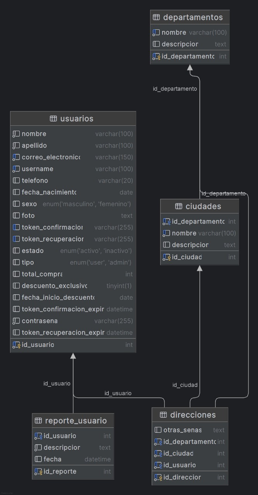

---
## Productos
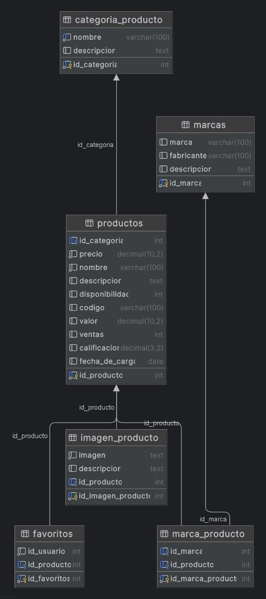

---
## Devolucion
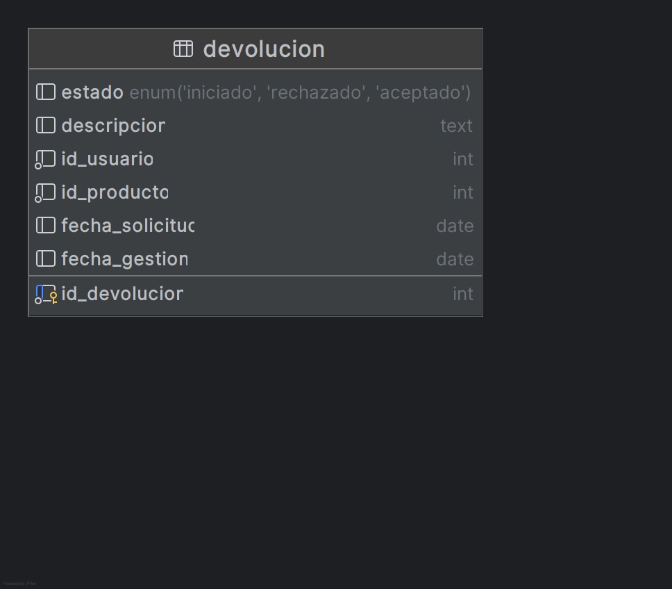

---
## Descuentos
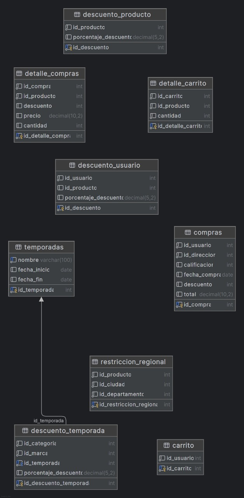
---

# 8. Metodología Ágil

- Sprints:

* Planificación de Sprints – Fase III
Sprint 1: Estructura Inicial y Funcionalidad de Devoluciones
Duración: 2 dias
Objetivo: Implementar estructura del módulo de devoluciones y lógica principal.

Tareas:
- Crear modelos y migraciones para devoluciones.

- Endpoint: iniciar solicitud de devolución.

- Validar productos no elegibles (en descuento o usados).

- Panel restringido de revisión de devoluciones.

- Prueba unitaria del flujo completo.

* Sprint 2: Pagos e Integración de Métodos de Pago
Duración: 2 dias
Objetivo: Establecer flujo de pagos seguro.

Tareas:
- Implementar integración con pasarela de pagos (mock o real).

- Soportar pagos híbridos (tarjeta de crédito + débito).

- Validaciones de tarjetas.

- Confirmación de compra y generación de orden.

- Pruebas de transacción exitosa y fallida.

* Sprint 3: Chatbot para Soporte Básico y Carrito
Duración: 1 dia
Objetivo: Proveer atención automática vía chatbot.

Tareas:
- Configuración básica de AWS Lex o solución elegida.

- Entrenar intents para:

- Consultas sobre productos y pedidos.

- Proceso de devolución.

- Agregar producto al carrito (por nombre y cantidad).

- Integración con backend vía API Gateway / microservicio.

* Sprint 4: Monitoreo y Registros (Fase III)
Duración: 1 dia
Objetivo: Establecer monitoreo completo del sistema.

Tareas:
- Instalar y configurar Prometheus.

- Crear dashboards en Grafana:

- Microservicio de devoluciones.

- Microservicio de pagos.

- Uso de CPU/RAM por clúster.

- Implementar logging en microservicios con loguru/winston.

- Integración de ELK Stack: Logstash → Elasticsearch.

* Sprint 5: Pruebas, Documentación y Entrega Final
Duración: 1 dia
Objetivo: Consolidar pruebas, documentación técnica y funcional.

Tareas:
- Pruebas de sistema (funcional, errores, recuperación).

- Documentación de:Funcionalidades IX, X, XI.

- Instalación y uso de Prometheus, Grafana, ELK.

- Casos de uso, contratos, arquitectura.

- YAMLs de pipelines actualizados.


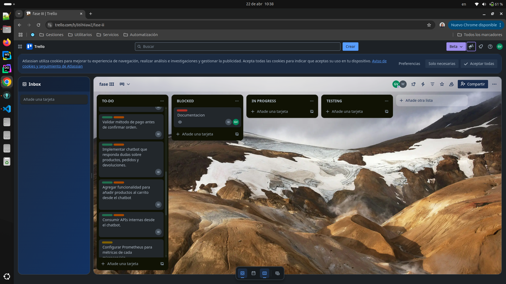

---
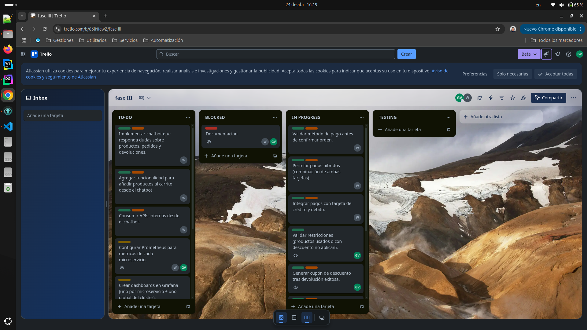

---
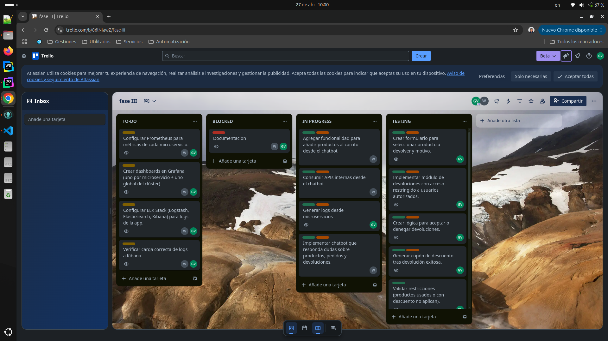
---
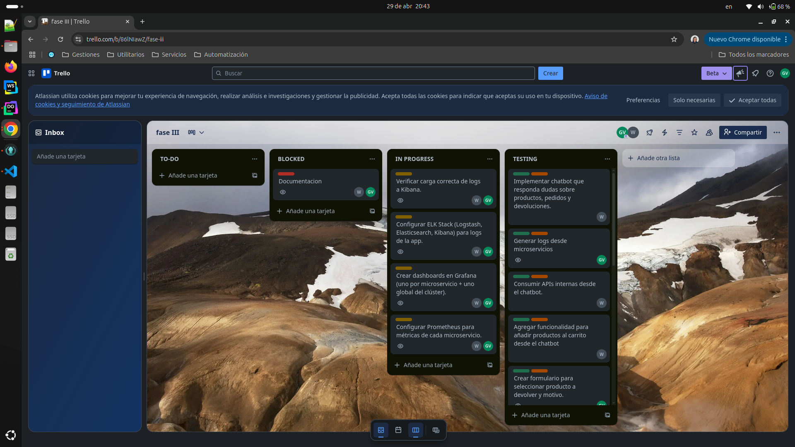
---
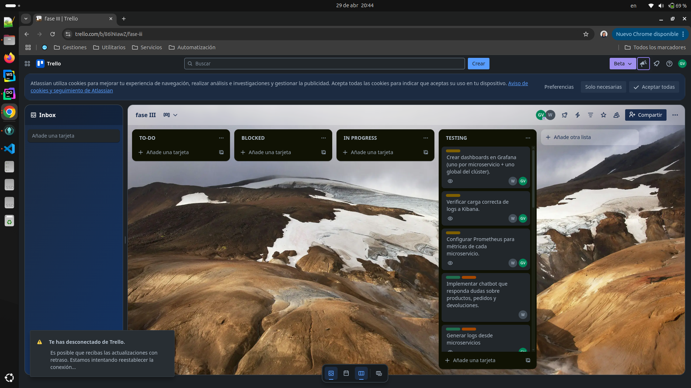


---

# 9. Requerimientos Funcionales y No Funcionales

### Requerimientos Funcionales

## Requisitos Funcionales

### Fase I – Funcionalidades base del usuario
- Registro de usuario con los siguientes datos:
  - ID de usuario
  - Nombre
  - Apellido
  - Correo electrónico
  - Nombre de usuario
  - Teléfono
  - Dirección (ciudad y departamento)
  - Fecha de nacimiento
  - Sexo
  - Foto (opcional)
- Confirmación de cuenta vía correo electrónico con caducidad de 2 minutos.
- Inicio de sesión usando correo o nombre de usuario y contraseña.
- Edición de perfil:
  - Correo electrónico
  - Teléfono
  - Dirección (una o más)
- Visualización de productos sin necesidad de estar registrado.

---

### Fase II – Gestión de Usuarios, Productos y Catálogo

#### Control de usuarios (Administrador)
- Activar y desactivar cuentas.
- Crear cuentas manualmente.
- Administrar promociones y descuentos.
- Gestionar usuarios reportados o con incidencias.

#### Gestión de productos
- Carga de productos por usuarios con los siguientes datos:
  - ID, nombre, código, descripción
  - Categoría, marca (una o más), valor
  - Restricción de venta por región
  - Precio, disponibilidad, imágenes

#### Catálogo de productos
- Filtros de exploración por:
  - Más vendidos
  - Ofertas
  - Categoría
  - Recomendados según historial
  - Calificación
  - Nuevos productos
  - Rebajas de temporada
  - Precio
  - Marca

#### Descuentos exclusivos por acumulación
- Aplicación automática tras superar Q10,000 en compras acumuladas.
- Descuento según monto:
  - Q10,000–Q12,999 → 5%
  - Q13,000–Q16,999 → 10%
  - Q17,000 o más → 20%
- Válido por 30 días, uso único, no acumulable.

#### Historial de compras
- Visualización de productos comprados.
- Filtros por fecha, precio y calificación.
- Acumulado visible por:
  - Últimos 30 días
  - Últimos 6 meses
  - Últimos 12 meses
  - Histórico total

#### Favoritos
- Agregar productos a lista de favoritos.
- Notificaciones por baja de precio o stock limitado.

#### Carrito de compras
- Agregar, eliminar, modificar productos.
- Cálculo automático de impuestos y envío.
- Aplicación de promociones y descuentos disponibles.
- Confirmación de compra y seguimiento del pedido en tiempo real.

---

### Fase III – Funcionalidades avanzadas y monitoreo

#### IX. Devoluciones
- Solicitud de devolución con selección de motivo.
- Solo aplica si el producto no está en descuento, no fue usado ni dañado.
- Módulo exclusivo para usuarios autorizados.
- Aceptación/rechazo por parte del sistema.
- Generación de cupón equivalente al valor del producto devuelto.

#### X. Pagos
- Pago con tarjeta de crédito y débito.
- Pagos híbridos (combinación de tarjetas).

#### XI. Soporte por Chatbot
- Consultas sobre productos, devoluciones y pedidos.
- Agregar productos al carrito usando el nombre y la cantidad.

#### Monitoreo y registros
- Uso de Prometheus para métricas.
- Dashboards en Grafana por microservicio y uso de clúster.
- ELK Stack para logs (Logstash, Elasticsearch, Kibana).
- Logs generados en microservicios y visualizados en Kibana.

--- 

### Requerimientos No Funcionales

- **Escalabilidad:** Arquitectura basada en microservicios y contenedores.
- **Mantenibilidad:** Código modular, documentación clara, pruebas integradas.
- **Seguridad:**
  - Validación de entradas
  - Autenticación segura
  - Confirmación por correo
- **Disponibilidad:** Despliegue en la nube, alta disponibilidad.
- **Monitoreo y logging:**
  - Implementación de Prometheus, Grafana y ELK Stack.
  - Logs centralizados accesibles desde Kibana.
- **Usabilidad:** UI amigable y accesible para todos los usuarios.
- **Portabilidad:** Contenedores Docker y orquestación con Kubernetes.
- **Rendimiento:** Respuesta rápida (<1s) en funcionalidades críticas.

---

# 10. Diagrama de alto nivel del sistema

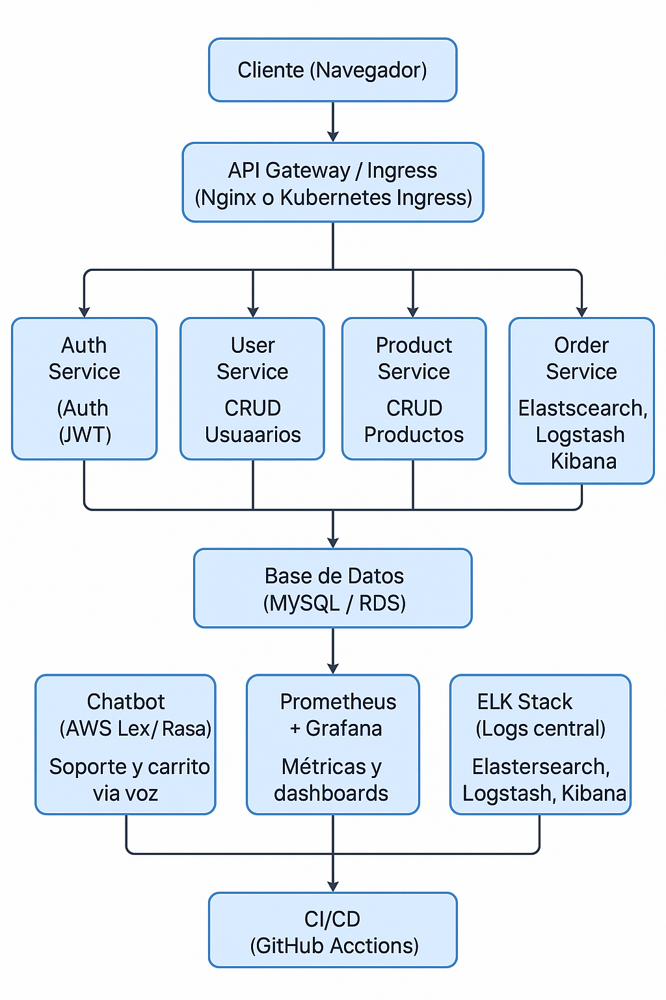

# 11. Contratos de Microservicios 

[Contratos de Microservicios](documentation/src/PY_SA.postman_collection.json)
---

# 12. Diagramas de Secuencia

- Registro y confirmación de usuario
- Agregado de producto al carrito y aplicación de descuentos
- Proceso de devolución y generación de cupón
- Proceso de pago híbrido
- Gestión de favoritos y alertas

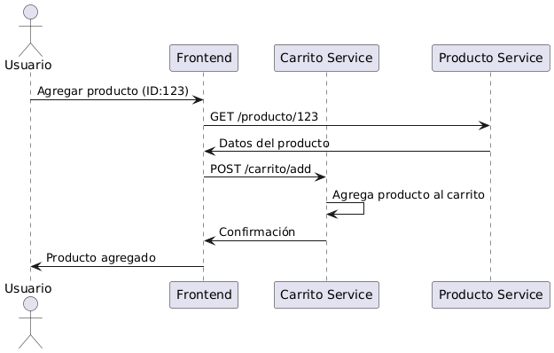
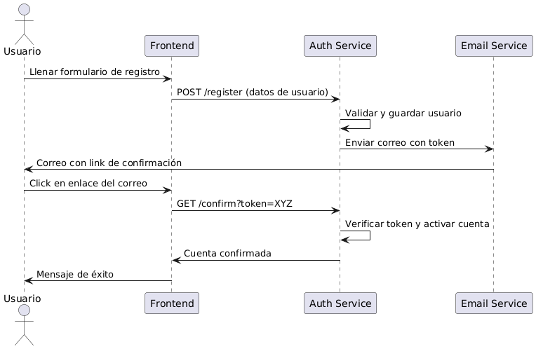
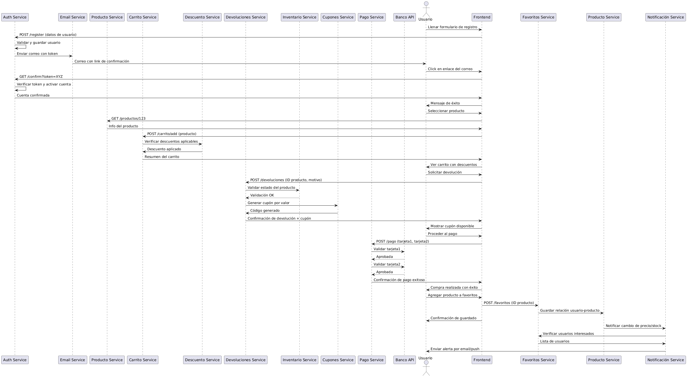


---

# 13. Gobernanza de Microservicios

- Versionado de APIs: /api/v1/...  
- Estándares RESTful: verbos HTTP correctos, respuestas uniformes, Swagger/Postman  
- Logs centralizados: ELK o Grafana Loki  
- Métricas: Prometheus y Grafana  
- Estrategias de reintento y circuit breaker: pybreaker, timeouts, fallback

---

